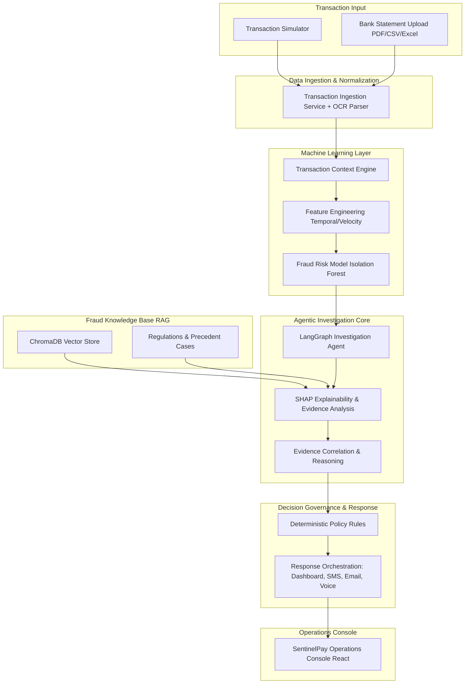

# SentinelPay: An Intelligent Real-Time Transaction Risk Monitoring & Fraud Detection Platform

**Department of Electronics & Telecommunication Engineering (E&TCE)**  
**Pune Institute of Computer Technology (PICT), Pune - 43**  
Academic Year: 2026-27 | Group No. 85

---

## 📌 Project Overview
**SentinelPay** is an AI-powered fraud detection and investigation platform that combines Machine Learning anomaly detection, Explainable AI (SHAP), Retrieval-Augmented Generation (RAG via ChromaDB), and autonomous LangGraph-based agentic reasoning.

Instead of making decisions based solely on raw model probabilities or brittle static rules, SentinelPay conducts multi-step autonomous investigations, correlates evidence against regulatory policies (RBI / PCI-DSS) and historical case precedents, and applies deterministic governance to decide whether transactions are **Approved**, **Flagged**, **Verified (Step-Up 2FA)**, or **Blocked**.

---

## 🏛️ System Architecture



---

## 🚀 Key Modules & Capabilities

1. **Multi-Modal Data Ingestion**:
   - Real-time API streaming and Kafka event bus (`redpanda`).
   - Batch ingestion (`.csv`, `.xlsx`).
   - Bank Statement parsing with OCR extraction support for scanned PDFs.

2. **Machine Learning & SHAP Explainability**:
   - Feature engineering for velocity, geographic jumps, and temporal bursts.
   - Isolation Forest anomaly detection and risk scoring.
   - Mathematically backed SHAP feature attribution (e.g. `+0.38` velocity spike, `+0.29` geo-teleportation).

3. **RAG Knowledge Base (ChromaDB)**:
   - Vector indexing of RBI Circulars, PCI-DSS compliance requirements, and historical fraud case precedents.
   - Dynamic vector lookup and contextual prompt injection for investigative agents.

4. **Agentic Fraud Investigation Core (LangGraph)**:
   - Dynamic 5-step investigation plans (Entity Resolution, Velocity Audit, Geospatial Trajectory, Regulatory Citation, Risk Correlation).
   - Autonomous tool selection and evidence synthesis.

5. **Decision Governance & Response Orchestration**:
   - Policy guardrails validating agent recommendations before execution.
   - Action states: `APPROVED`, `FLAGGED`, `VERIFIED`, `BLOCKED`.
   - Multi-channel notification pipeline (Dashboard Live Feed, Email, SMS, Voice).

6. **Operations Console**:
   - Real-time incident triage and investigation workbench.
   - Interactive SHAP waterfall breakdown.
   - Knowledge Base explorer and semantic vector lookup simulation.

---

## 🔑 Demo & Test Credentials

| Account | Email | Password | Role |
|---|---|---|---|
| **Admin Operations** | `admin@sentinelpay.io` | `Admin@123456` | `ADMIN` |
| **Demo Analyst** | `demo@sentinelpay.io` | `Demo@123456` | `USER` |

> **Authentication Bypass**: You can also use `Bearer bypass` in headers for automated testing or in the simulator UI.

---

## 🛠️ Quick Start Guide

### 1. Infrastructure Services (Docker)
Start the PostgreSQL, Redis, and Redpanda Kafka containers:
```powershell
.\start-dev.ps1 -Infra
```

### 2. Start Full Platform
Start all backend services, frontend console, and simulator in a single unified process:
```powershell
.\start-dev.ps1
```

- **Operations Console**: [http://localhost:5173](http://localhost:5173)
- **Agent Investigations**: [http://localhost:5173/investigations](http://localhost:5173/investigations)
- **RAG Knowledge Base**: [http://localhost:5173/knowledge](http://localhost:5173/knowledge)
- **Transaction Simulator**: [http://localhost:5174](http://localhost:5174)
- **Redpanda Console**: [http://localhost:8080](http://localhost:8080)

---

## 📚 Project References

1. Z. Liu, J. Gao, H. Yu, and X. Luo, *"A Robust Graph Fraud Detection Model Based on Adversarial Reweighting"*, 2025.
2. H. M. R. Al Lawati, et al., *"An Integrated Preprocessing and Drift Detection Approach With Adaptive Windowing for Fraud Detection in Payment Systems"*, 2025.
3. F. T. Liu, K. M. Ting, and Z.-H. Zhou, *"Isolation Forest"*, ICDM.
